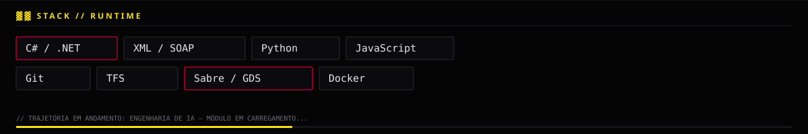

<!-- ================================================================== -->
<!-- NEO-TOKYO PROTOCOL — MIQUÉIAS SOUZA                                 -->
<!-- Header e stack são SVGs próprios (banner.svg / techstack.svg),     -->
<!-- não geradores de terceiro — troque cor/texto direto neles.         -->
<!-- ================================================================== -->

 

> Desenvolvedor atuando em sistemas de reserva aérea — parsing de PNR, classificação de segmentos de voo e integração GDS/Sabre via SOAP/XML em C#, dentro de um fluxo versionado em TFS.
> Trajetória em andamento: engenharia de IA.

 

 

---

<h3>▓▓ TELEMETRIA — dados reais da conta</h3>

Esta seção puxa dados ao vivo do GitHub (commits, linguagens, streak) — não dá pra "recriar do zero" sem virar estático e falso. Mantida funcional, na mesma paleta do resto.

 

 

---

<h3>▓▓ MÉTRICAS — lowlighter/metrics</h3>

Também dados ao vivo, gerados pela sua própria Action — só populam depois de configurada.

  

 

---

<h3>▓▓ UPLINK</h3>

