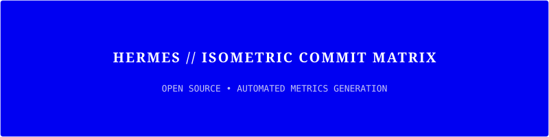
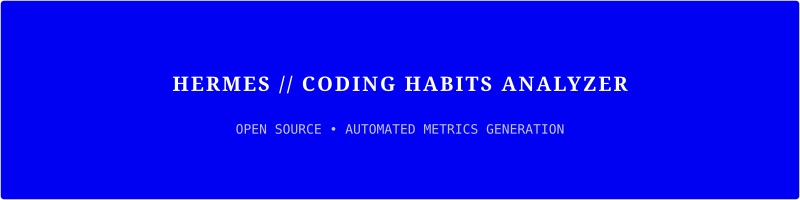
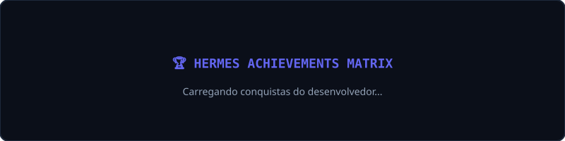

<div align="center">
  <!-- HERMES AGENT STYLE BANNER -->
  
</div>

<!-- TYPING MONOSPACE TAGLINE -->
<div align="center">
  <a href="https://git.io/typing-svg">
    
  </a>
</div>

<br/>

<!-- HERMES TERMINAL CONSOLE -->
<div align="center">

```text
┌──────────────────────────────────────────────────────────────────────────────┐
│  SYSTEM STATUS: ONLINE | AGENT CORE: HERMES v2.5                             │
├──────────────────────────────────────────────────────────────────────────────┤
│  $> User      : Miquéias Souza Rodrigues                                      │
│  $> Role      : Autonomous Systems & Full-Stack Architect                    │
│  $> Focus     : Agentic Workflows, LLM Infrastructure & Microservices        │
│  $> Location  : Brazil 🇧🇷                                                    │
│  $> Core Logic: "Transforming complex problems into elegant code."           │
└──────────────────────────────────────────────────────────────────────────────┘
```

</div>

<br/>

---

### ⚡ Technical Capabilities & Agent Stack

<div align="center">

| Module | Technologies & Tools |
| :--- | :--- |
| **Languages** |      |
| **AI & Backend** |     |
| **Frontend UI/UX** |    |
| **Data & Cloud** |     |

</div>

<br/>

---

### 📊 Agent Telemetry & GitHub Analytics

<div align="center">
  
  
</div>

<br/>

<div align="center">
  
</div>

<br/>

---

### 🎨 Lowlighter Metrics Engine (Isometric 3D & Habits)

<div align="center">

  <!-- 3D Commit Graph -->
  <h4>🗓️ 3D Isometric Activity Matrix</h4>
  

  <br/><br/>

  <!-- Coding Habits -->
  <h4>⚡ Coding Patterns & Habits Analysis</h4>
  

  <br/><br/>

  <!-- Achievements -->
  <h4>🏆 Agent Achievements & Badges</h4>
  

</div>

<br/>

---

### 🐍 Contribution Matrix (Snake Animation)

<div align="center">
  <picture>
    <source media="(prefers-color-scheme: dark)" srcset="https://raw.githubusercontent.com/MiqueiasSouzaRodrigues/MiqueiasSouzaRodrigues/output/github-contribution-grid-snake-dark.svg">
    <source media="(prefers-color-scheme: light)" srcset="https://raw.githubusercontent.com/MiqueiasSouzaRodrigues/MiqueiasSouzaRodrigues/output/github-contribution-grid-snake.svg">
    
  </picture>
</div>

<br/>

---

### 🌐 Transmission & Connectivity

<div align="center">

  <a href="mailto:criandoloja3@gmail.com">
    
  </a>
  <a href="https://github.com/MiqueiasSouzaRodrigues" target="_blank">
    
  </a>

</div>

<br/>

<div align="center">
  
</div>

<br/>

<div align="center">
  
</div>
